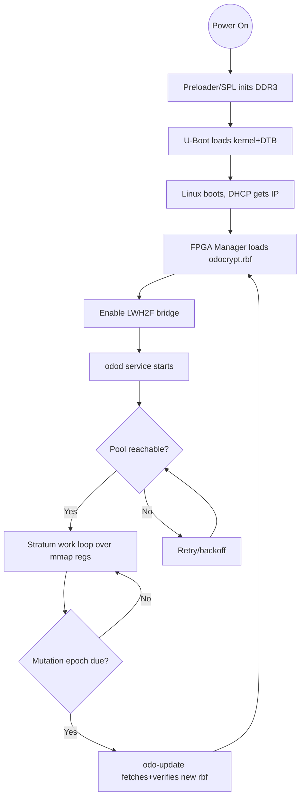

# Standalone (PC-less) OdoCrypt FPGA Miner — Engineering Build Plan

> **Purpose of this document:** This is a complete, self-contained handoff specification for porting the [odo-miner](https://github.com/MentalCollatz/odo-miner) OdoCrypt FPGA mining design onto a **QMTECH Cyclone V SoC board (QMTECH_Cyclone_V_SoC_KFB)** so it mines DigiByte's OdoCrypt algorithm **fully autonomously, with no host PC attached at runtime**. An engineer or AI agent should be able to execute this plan top-to-bottom. Assume no prior conversation context.

---

## 0. Executive Summary

The `odo-miner` project (by MentalCollatz) is an open-source FPGA bitstream + host controller for mining DigiByte's **OdoCrypt** proof-of-work algorithm. In its stock form it runs the hashing logic on an FPGA dev board (originally targeted at DE2-115 / Cyclone IV–class boards) while a **host PC** runs the control software that talks to a mining pool over the Stratum protocol and feeds work to the FPGA over a serial/JTAG link.

This plan removes the host PC entirely. We exploit the fact that the target board is a **Cyclone V SoC**, which fuses an FPGA fabric (the *PL*, Programmable Logic) with a dual-core ARM Cortex-A9 **Hard Processor System (HPS)** on the same die. The HPS runs a minimal embedded Linux (built with Buildroot), boots from an SD card via U-Boot, loads the mining bitstream into the FPGA fabric at power-up, and runs a small **miner control daemon** that:

1. connects to the pool over the onboard Gigabit Ethernet PHY,
2. speaks Stratum to fetch work,
3. writes work + reads results across the **HPS-to-FPGA bridges** (memory-mapped register access), and
4. submits found shares back to the pool.

**The single most important architectural insight:** the original odo-miner host↔FPGA transport (a slow serial/USB/JTAG channel) is replaced by **on-chip memory-mapped I/O over the Avalon-MM / AXI lightweight bridge**. This is faster, has no cabling, and is the key enabler of full autonomy. Roughly 70% of the engineering effort is in (a) re-wiring the FPGA top-level to expose its control registers on an Avalon-MM slave instead of a serial interface, and (b) writing the userspace daemon that drives those registers via `/dev/mem` (or a small kernel UIO driver).

## 1. Background & Goal

**OdoCrypt** is DigiByte's ASIC-resistant PoW algorithm. Its defining feature is that the algorithm *mutates itself every ~10 days* (the "Odo" permutation/S-box set changes on a schedule). This is why FPGAs are the sweet spot: an ASIC would be obsoleted at each mutation, but an FPGA can simply be **reconfigured with a freshly synthesized bitstream** that bakes in the new permutation. This has a major implication for our design: the system must be able to **accept and load a new bitstream periodically** (every mutation epoch) without a technician on site. We design for that from day one.

**odo-miner** structure (stock):

- `hdl/` — Verilog hashing core (the OdoCrypt rounds + nonce iteration + comparator against target).
- `host/` — C/C++ host application that talks Stratum to a pool and pushes work/reads results to the FPGA over a transport layer.
- A transport (serial/UART or JTAG-Atlantic style) bridging host ↔ FPGA registers.

**The board:** QMTECH Cyclone V SoC core board (typically `5CSEBA6U23I7` or similar 5CSE-class device) on a baseboard providing Gigabit Ethernet, micro-SD, DDR3 for the HPS, USB, and FPGA-side SDRAM/IO. Confirm the exact device part number printed on the chip before synthesis — it determines the Quartus device selection and pin assignments.

**"Standalone" / autonomous** is defined here as: *plug in power + Ethernet, and within ~60 seconds the board boots, configures its own FPGA, joins the pool, and begins submitting shares — with no PC, no USB cable, and no human interaction. It survives reboots and power loss, and can self-update its bitstream at OdoCrypt mutation epochs.*

## 2. Target Hardware Reference

| Item | Detail | Notes for this project |
|---|---|---|
| SoC | Intel/Altera Cyclone V SoC (5CSE-class, e.g. `5CSEBA6U23I7`) | Dual ARM Cortex-A9 HPS + FPGA fabric on one die |
| FPGA fabric (PL) | ~110K LE, embedded multipliers, M10K blocks | Hosts the OdoCrypt hashing cores |
| HPS | 2× Cortex-A9 @ ~800 MHz–1 GHz, on-chip peripherals | Runs Linux + miner daemon |
| HPS DDR3 | On core board, dedicated to HPS | Used by Linux, *not* by hashing cores |
| HPS↔FPGA bridges | **HPS-to-FPGA (H2F)**, **Lightweight HPS-to-FPGA (LWH2F)**, **FPGA-to-HPS (F2H)** | Memory-mapped bridges = our control transport |
| Ethernet | Gigabit PHY (often wired to HPS EMAC) | Pool connectivity; confirm it's on HPS EMAC not FPGA |
| WiFi | USB WiFi adapter (RTL8192EU or similar; confirmed working) | Optional wireless connectivity; configured via web dashboard (`odo-webd`) or `wpa_supplicant` — see `docs/USB_WIFI.md` |
| Display | 2.8″ ILI9341 SPI touch TFT on GPIO_0 | Local status dashboard (`odo-ui`) with touch restart/reboot — see `docs/DISPLAY_WIRING.md` |
| Storage | micro-SD | Boot media: preloader, U-Boot, kernel, rootfs, bitstreams |
| FPGA SDRAM | Optional SDRAM on FPGA side of QMTECH board | Only needed if hashing core requires external buffer (odo-miner core is largely self-contained) |
| Config | FPGA configured by HPS at boot (FPGA-after-HPS flow) | No external JTAG blaster needed at runtime |

**Key addressing facts (verify against your specific SoC/Qsys):**

- Lightweight HPS-to-FPGA bridge base address is conventionally `0xFF20_0000` (LWH2F), 2 MB window — ideal for low-bandwidth control/status registers.
- HPS-to-FPGA bridge base is conventionally `0xC000_0000` (H2F) — used for higher-bandwidth transfers if ever needed.
- FPGA manager control for runtime reconfiguration is exposed via Linux's **FPGA Manager** framework (`/sys/class/fpga_manager/fpga0/`) and Device Tree Overlays.

> **Action:** Before any RTL work, download the QMTECH board's reference design / GHRD (Golden Hardware Reference Design) and its Quartus project. It already contains a working Qsys system with the bridges, HPS pin assignments, and SDRAM controller. We build *on top of* it rather than from scratch.

## 3. System Architecture

**Layer stack (bottom → top):**

| Layer | Component | Responsibility |
|---|---|---|
| PL | OdoCrypt hashing cores (N parallel) | Iterate nonces, hash, compare against target |
| PL | **Avalon-MM slave register block** (new) | Exposes: header/midstate, target, start/stop, found-nonce, status |
| Bridge | LWH2F (Avalon-MM, mapped at `0xFF20_0000`) | Carries register reads/writes between HPS and PL |
| HPS kernel | Linux + FPGA Manager + (optional) UIO driver | Bridge enable, `/dev/mem` access, bitstream load |
| HPS user | **miner daemon** (`odod`) | Stratum client + work scheduler + register driver |
| HPS user | **updater** (`odo-update`) | Fetches new bitstream at mutation epoch, triggers reconfig |
| Net | Gigabit Ethernet (HPS EMAC) | Pool connection |

**Runtime data flow:**

```
Pool ──Stratum(JSON/TCP)──> [odod daemon] ──build work──> write regs over LWH2F ──> OdoCrypt cores
                                  ^                                                      |
                                  |                                            nonce found / status
   submit share <──Stratum───────┴──────────read found-nonce reg over LWH2F────────────┘
```

**Why memory-mapped (Avalon-MM) instead of serial:** The HPS sees the FPGA register block as ordinary physical memory at `0xFF20_xxxx`. A userspace process `mmap()`s `/dev/mem` at that base and reads/writes registers as if they were pointers. Latency is sub-microsecond vs. milliseconds for UART/JTAG, there is no cable, and it is the natural primitive for autonomy. This **replaces** odo-miner's original transport layer entirely.

A Mermaid version of the boot+control flow is provided in section 7.

## 4. Repository & Source Analysis Tasks

Before writing code, fully characterize the stock odo-miner so we know exactly which interface to replace. Produce a short "interface contract" document from this analysis.

**4.1 — Read the HDL (`hdl/`).** Identify:

- The top-level module and its port list. Which ports are the *control interface* (work in, result out, clock, reset) vs. the hashing pipeline?
- The exact bit layout of a work unit the core expects: block header / midstate width, target/difficulty representation, starting nonce, nonce range.
- How a found nonce is signaled: a `found` flag + `nonce_out` register? An interrupt line? A FIFO?
- The number of parallel cores and the LE/DSP/RAM utilization (to confirm it fits the 5CSE device and to set core count `N`).
- The hashing clock frequency the design targets (sets timing constraints).

**4.2 — Read the host (`host/`).** Identify:

- The transport abstraction (the function(s) that read/write FPGA registers — likely over serial or JTAG-Atlantic). **This is the seam we cut.** Catalog every register offset and its meaning.
- The Stratum client logic: how it subscribes, authorizes, receives `mining.notify`, builds the block header, computes midstate, iterates extranonce, and submits `mining.submit`. **We keep this logic; we only swap the transport underneath it.**
- The work-scheduling loop and how difficulty/target is converted to the core's comparator format.

**4.3 — Deliverable from this phase:** a register map table (offset, name, R/W, width, semantics) and a one-page description of the Stratum→work→core data transformation. Everything downstream depends on this contract.

4.4 — Standalone Repository Structure & Version Control
The standalone port should live in its own repository (e.g. odo-miner-cyclonev) that vendors or submodules the upstream MentalCollatz/odo-miner as the HDL/host baseline. A monorepo is strongly recommended: the FPGA bitstream, the matching Avalon-MM register map, and the odod daemon that drives it must stay in lockstep, so they should version and tag together. Because OdoCrypt mutates every ~10 days, each epoch's bitstream must be traceable to the exact commit that produced it — this is a hard requirement, not a nicety.

Suggested layout:

odo-miner-cyclonev/
├── README.md                       # Quickstart: build → SD image → flash → mine
├── LICENSE
├── .gitignore                      # build/, *.sof, *.rbf cache, output_files/, logs/
├── .gitattributes                  # Git LFS rules for *.rbf / *.sof / *.pof / SD images
├── docs/
│   ├── M1-interface-contract.md    # Register map + Stratum→work transform (the §4 deliverable)
│   ├── architecture.md             # Layer stack, LWH2F mapping, data flow (§3)
│   ├── register-map.md             # §5.1 table — single source of truth
│   ├── bringup-plan.md             # §9 staged validation, M1–M8
│   └── bringup-logs/               # Per-milestone test logs (M2…M8 artifacts)
│
├── third_party/odo-miner/          # vendored upstream subset (crypto/ + verilog/odo_gen), GPLv3 — see NOTICE
│
├── hdl/
│   ├── src/
│   │   ├── odo_avalon_wrapper.v    # New Avalon-MM slave wrapping the core (§5.1)
│   │   ├── odocrypt/               # Core (adapted from upstream hdl/)
│   │   └── cdc/                    # Clock-domain-crossing handshakes / dual-clock FIFOs
│   ├── constraints/
│   │   └── odo.sdc                 # Hash clock, Avalon clock, async clock groups (§5.3)
│   ├── qsys/                       # Platform Designer system built on the QMTECH GHRD (§5.2)
│   └── quartus/                    # .qpf/.qsf, compile scripts → .sof/.rbf (§5.5)
│
├── bitstreams/                     # Git LFS; one .rbf per mutation epoch
│   ├── odocrypt-epochNNNN.rbf
│   └── MANIFEST.md                 # commit SHA ↔ epoch ↔ checksum/signature
│
├── boot/
│   ├── preloader/                  # Generated from Quartus handoff / bsp-editor (§6.2)
│   ├── u-boot/                     # Config + boot scripts
│   └── devicetree/                 # soc_system.dts + FPGA Manager overlay (§6.2)
│
├── linux/
│   ├── buildroot/                  # Buildroot defconfig + overlay (§6.1)
│   └── sdcard/                     # Image assembly script (FAT/ext4/0xA2 layout)
│
├── sw/
│   ├── odod/                       # Ported daemon: reused Stratum + mmap transport (§6.4)
│   │   ├── transport_mmap.c        # The seam that replaces serial/JTAG
│   │   └── stratum/                # Unchanged subscribe/authorize/notify/submit
│   ├── odo-update/                 # Mutation-epoch self-update service (§6.7)
│   ├── uio-driver/                 # Optional kernel UIO driver + dts node (§6.3)
│   └── config/
│       └── odod.conf.template      # Pool URL, worker, FPGA base addr (§6.5)
│
├── services/                       # init/systemd units, auto-restart for autonomy (§6.6)
│   ├── odod.service
│   └── odo-update.service
│
├── scripts/
│   ├── build_bitstream.sh          # Quartus → .sof → .rbf (per-epoch regeneration)
│   ├── make_sdcard.sh
│   └── flash_rbf.sh                # FPGA Manager load + bridge enable
│
└── ci/
    └── pipeline.yml                # HDL lint, sw cross-build, register-map/doc sync check
Branching & tagging conventions: use a trunk-based model with a protected main; do feature work on short-lived feat/* branches. Tag hardware-validated checkpoints to your milestones (m4-core-integrated, m7-autonomy, etc.) and tag each shipped epoch atomically across hdl/, boot/, and sw/ as epoch-NNNN. Every .rbf in bitstreams/ must record its source commit SHA in MANIFEST.md.

Supporting practices: store all large binaries (.rbf/.sof/SD images) via Git LFS to keep clones lean; keep bringup-logs/ committed (they're a named §11 deliverable) but git-ignore transient logs/; and add a pre-commit hook that fails if docs/register-map.md drifts from the wrapper's actual register definitions — register-map/CDC mismatches are exactly the §9 failure mode you flagged as most common, so catching drift in CI pays off.

## 5. FPGA / Hardware (PL) Work

**5.1 — Build an Avalon-MM register wrapper.** Write a new Verilog module `odo_avalon_wrapper.v` that instantiates the existing OdoCrypt core(s) and exposes a clean Avalon-MM slave. Suggested register map (32-bit words, offsets from LWH2F base):

| Offset | Name | R/W | Meaning |
|---|---|---|---|
| `0x00` | `CTRL` | RW | bit0=start, bit1=reset, bit2=enable |
| `0x04` | `STATUS` | RO | bit0=busy, bit1=found, bit2=idle |
| `0x08`–`0x47` | `HEADER[0..15]` | WO | 512-bit block header / midstate |
| `0x48` | `TARGET` | WO | compressed target / difficulty |
| `0x4C` | `NONCE_START` | WO | base nonce for this work unit |
| `0x50` | `NONCE_FOUND` | RO | winning nonce when `found`=1 |
| `0x54` | `CORE_COUNT` | RO | N (for daemon introspection) |
| `0x58` | `HASHRATE` | RO | optional rolling counter |

Use a standard Avalon-MM slave handshake (`address`, `read`, `write`, `readdata`, `writedata`, `waitrequest` tied low for single-cycle regs). Cross clock domains carefully: the Avalon bus runs at the bridge clock (~100 MHz), the hashing core may run at a different clock — use proper CDC (handshake or dual-clock FIFO) for the start pulse and found flag.

**5.2 — Integrate into Qsys / Platform Designer.** Open the QMTECH GHRD, add your `odo_avalon_wrapper` as a component, and connect its Avalon-MM slave to the **lightweight HPS-to-FPGA bridge** master. Export the hashing clock from a PLL. Note the assigned base address (Qsys auto-assigns within the LWH2F window) — the daemon must use this exact address.

**5.3 — Clocking & constraints.** Provide an SDC file: constrain the FPGA reference clock, the PLL-generated hash clock, and declare the Avalon and hash domains as asynchronous (`set_clock_groups -asynchronous`). Start the hash clock conservatively (e.g. 50–100 MHz) and push it up only after timing closes.

**5.4 — SDRAM (only if required).** The stock OdoCrypt core is largely self-contained and typically does *not* need external SDRAM for hashing state. Only port the FPGA-side SDRAM controller if section 4.1 reveals the core needs an external buffer. If not needed, skip — this removes a major source of complexity and risk.

**5.5 — Synthesize.** Compile in Quartus (use a version that supports your device, e.g. Quartus Prime 21.1+/Lite). Produce the `.sof`, then convert to the runtime-loadable formats:

- `.rbf` (raw binary file) for FPGA Manager loading from Linux — generate the *uncompressed/Type-appropriate* RBF for the "FPGA configured after HPS" flow.
- Keep the `.sof` for JTAG bring-up debugging only.

**5.6 — Utilization & thermal check.** Confirm the design fits and add a heatsink/fan plan — sustained hashing will run the FPGA hot.

## 6. HPS / Software Work

**6.1 — Embedded Linux image.** Build a minimal rootfs with **Buildroot** (preferred for small footprint) or Yocto. Required components: kernel with Cyclone V SoC + FPGA Manager + bridge support, networking stack, DHCP client, an init system (BusyBox init or systemd), and the cross-compiled miner daemon. SD card layout (typical Altera SoC):

- Partition 1 (FAT): `u-boot.img`, `zImage`, `soc_system.dtb`, device-tree overlay, and the `.rbf` bitstream(s).
- Partition 2 (ext4): root filesystem.
- Partition 3 (raw, type `0xA2`): SPL/preloader.

**6.2 — Preloader + U-Boot.** Generate the preloader from the Quartus handoff (`bsp-editor`). U-Boot brings up HPS DDR3 and the boot chain. **Decision: where to load the FPGA?** Two options:

- *U-Boot loads the RBF* (`fpga load ...` / `bridge enable`) before booting Linux — simplest, FPGA up before kernel.
- *Linux FPGA Manager loads the RBF* via a device tree overlay after boot — better for runtime re-flash at mutation epochs.

Recommended: do the initial load in Linux via FPGA Manager so the same mechanism handles mutation-epoch reconfiguration. Enable the LWH2F bridge after configuration.

**6.3 — Bridge enable + register access.** At boot, ensure the lightweight bridge is enabled (`/sys/class/fpga-bridge/` or U-Boot `bridge enable`). The daemon accesses registers by `open("/dev/mem")` + `mmap()` at the LWH2F base + the Qsys-assigned offset. Optionally write a tiny **UIO** driver so the daemon doesn't need root `/dev/mem` and can receive the found-nonce interrupt instead of polling.

**6.4 — Port the miner daemon (`odod`).** Take odo-miner's `host/` code and **replace only the transport layer** with an mmap register driver implementing the section 5.1 register map:

- `write_work(header, target, nonce_start)` → write HEADER regs, TARGET, NONCE_START, then pulse CTRL.start.
- `poll_result()` → read STATUS; if `found`, read NONCE_FOUND (or block on UIO interrupt).
- Keep the existing Stratum client, header/midstate construction, difficulty conversion, and share submission **unchanged**.

**6.5 — Configuration file.** `/etc/odod.conf` holds pool URL, worker name/password, and FPGA base address. Read on startup so the same image works across deployments.

**6.6 — Service supervision.** Run `odod` under an init service that **auto-restarts on crash** and starts on boot. This is essential for autonomy.

**6.7 — Mutation-epoch self-update (`odo-update`).** A small service that, on schedule (or when the pool signals a new algo epoch), downloads the freshly synthesized `.rbf` from a known URL/local store, verifies a checksum/signature, reconfigures the FPGA via FPGA Manager, re-enables the bridge, and restarts `odod`. Bitstreams for each upcoming epoch should be pre-built on a workstation in Quartus and published to where the board can fetch them.

## 7. Boot & Autonomy Chain

Power-on to mining sequence:

1. **Power on** → BootROM loads the **preloader (SPL)** from the SD raw partition.
2. Preloader initializes HPS clocks, pin mux, and HPS DDR3, then loads **U-Boot**.
3. U-Boot loads `zImage` + `soc_system.dtb` (+ DT overlay) into DDR3 and boots **Linux**.
4. Linux brings up the EMAC, obtains an IP via **DHCP**.
5. **FPGA Manager** loads `odocrypt.rbf` into the fabric; the **LWH2F bridge is enabled**.
6. The **`odod` service** starts (auto-restart enabled), reads `/etc/odod.conf`, opens `/dev/mem`/UIO, and connects to the pool.
7. `odod` runs the Stratum work loop, driving the cores over memory-mapped registers and submitting shares. **Mining is now fully autonomous.**
8. In parallel, **`odo-update`** waits for the next mutation epoch and, when due, fetches+verifies a new `.rbf`, reconfigures the FPGA, and restarts `odod`.

A rendering-friendly diagram of this chain (create as a separate `.mmd` file if a visual is wanted):



## 8. Networking & Pool Integration

The daemon speaks **Stratum** (line-delimited JSON-RPC over TCP) to an OdoCrypt-supporting DigiByte pool. Core message flow that `odod` must implement (reuse odo-miner's existing client):

- `mining.subscribe` → receive subscription id + extranonce1 + extranonce2 size.
- `mining.authorize` with worker name/password.
- Receive `mining.set_difficulty` and `mining.notify` (job id, prevhash, coinbase parts, merkle branches, version, nbits, ntime, clean_jobs).
- Build the 80-byte block header per job, convert nbits → target, feed to cores, iterate nonce/extranonce.
- On found nonce: `mining.submit` (worker, job id, extranonce2, ntime, nonce).

**Robustness requirements for autonomy:**

- DHCP with retry; if no lease, keep retrying (don't give up).
- Stratum reconnect with exponential backoff on disconnect.
- Optional **failover pool list** in `/etc/odod.conf` — rotate to backup pool if primary is unreachable for N seconds.
- A watchdog (hardware HPS watchdog, petted by `S10watchdog`) that reboots the board if `odod` wedges and BusyBox init can't recover it.
- NTP (or RTC) for correct `ntime` and mutation-epoch timing.

## 9. Testing & Bring-up Plan

Validate in stages — never jump to full autonomy. Each stage gates the next.

1. **Linux bring-up (no FPGA):** Boot the GHRD Linux image, confirm console, Ethernet, DHCP, SSH.
2. **Bridge + dummy register:** Synthesize a trivial Avalon-MM slave with a known read-only constant (e.g. `0xDEADBEEF`) at the LWH2F offset. From Linux, `devmem`/a tiny C program reads it back. This proves the entire HPS↔FPGA path before touching the hashing core.
3. **Core in loopback:** Integrate the real OdoCrypt core. Write a *known* header/target whose solution nonce you've precomputed in software; confirm the core finds the same nonce and raises `found`. This validates the register map and CDC.
4. **Hashrate & timing:** Measure hashrate, raise the hash clock until timing fails, then back off with margin. Verify thermals under sustained load.
5. **Stratum against a test pool / testnet:** Point `odod` at a test pool (or solo testnet node). Confirm subscribe/authorize/notify/submit and accepted shares.
6. **Autonomy soak:** Pull the JTAG/serial cable, reboot from power only, confirm it self-boots and mines. Run a multi-day soak; verify auto-restart on induced crashes and reconnect on network drops.
7. **Mutation-epoch rehearsal:** Manually trigger `odo-update` with a second valid `.rbf`; confirm reconfiguration + bridge re-enable + `odod` restart with no manual steps.

## 10. Risks, Unknowns & Assumptions

| Risk / Unknown | Impact | Mitigation |
|---|---|---|
| Exact Cyclone V device part not confirmed | Wrong Quartus target, failed fit | Read the chip marking; confirm LE count fits N cores |
| odo-miner core targets a different FPGA family/IP | Core may not synthesize cleanly on Cyclone V | Expect to adapt vendor primitives (RAM, PLL) to Intel equivalents |
| Ethernet PHY wired to FPGA side, not HPS EMAC | No easy networking from Linux | Confirm board schematic; if FPGA-side, need a soft MAC or use a USB-Ethernet dongle |
| CDC bugs between Avalon clock and hash clock | Intermittent missed/false `found` | Rigorous handshake CDC; stage-3 loopback test catches this |
| Hashrate too low to be economical | Project not worth running | Set realistic expectations; maximize N and clock within timing |
| Mutation epoch breaks running design | Mining stops every ~10 days | `odo-update` pipeline must be tested and bitstreams pre-built |
| Thermal throttling/damage | Hardware failure | Heatsink + fan; monitor temp; throttle clock |
| `/dev/mem` security / stability | Daemon crashes, root exposure | Prefer a UIO driver; run service with auto-restart |

**Assumptions:** the OdoCrypt core in odo-miner is functionally correct and fits the device; the QMTECH GHRD is available with working HPS DDR3 + bridges; Ethernet is on the HPS EMAC; a workstation with Quartus is available to pre-build per-epoch bitstreams.

## 11. Deliverables & Milestones

**Milestones (in order):**

- **M1 — Analysis:** odo-miner interface contract: register map + Stratum/work transform doc.
- **M2 — Linux baseline:** Board boots GHRD Linux from SD, networks via DHCP.
- **M3 — Bridge proof:** Dummy Avalon register read/written from Linux over LWH2F.
- **M4 — Core integrated:** OdoCrypt core wrapped in Avalon-MM, loopback solves a known nonce.
- **M5 — Timing closed:** Hashrate measured, clock tuned, thermals validated.
- **M6 — Daemon ported:** `odod` mines against a test pool with accepted shares.
- **M7 — Autonomy:** Cable-free power-on boot to mining; multi-day soak passes.
- **M8 — Self-update:** `odo-update` reconfigures a new epoch bitstream unattended.

**Artifacts to hand back:**

- `odo_avalon_wrapper.v` + updated Quartus/Qsys project + SDC.
- `odocrypt.rbf` (+ build script to regenerate per epoch).
- Buildroot config + SD card image (preloader, U-Boot, kernel, DTB, rootfs).
- `odod` daemon source (ported transport + reused Stratum) + `/etc/odod.conf` template.
- `odo-update` service + init/service unit files.
- Optional UIO driver + device tree overlay.
- This document + the M1 interface contract + bring-up test logs.

## 12. Reference Links

- **odo-miner** — https://github.com/MentalCollatz/odo-miner (HDL + host source; the starting point).
- **DigiByte / OdoCrypt** — DigiByte docs on the OdoCrypt algorithm and ~10-day mutation schedule.
- **QMTECH Cyclone V SoC board** — vendor GHRD / reference design, schematic, and pin assignments (confirm exact device part).
- **Intel/Altera Cyclone V SoC** — Hard Processor System Technical Reference Manual (HPS↔FPGA bridges, LWH2F at `0xFF20_0000`, FPGA Manager).
- **Linux FPGA Manager framework** — kernel docs on `/sys/class/fpga_manager`, FPGA bridges, and device tree overlays for runtime reconfiguration.
- **RocketBoards.org** — GSRD/GHRD guides, Buildroot/Yocto for Cyclone V SoC, preloader + U-Boot SD boot flow.
- **Avalon Interface Specifications** — Intel doc for the Avalon-MM slave handshake used by the register wrapper.
- **Stratum mining protocol** — reference for `mining.subscribe/authorize/notify/submit` semantics.

---

### How to use this plan
Work top-to-bottom. Do **M1 (analysis) first** — the register map and work-transform contract it produces are prerequisites for almost every later step. Treat the Cyclone V SoC's memory-mapped HPS↔FPGA bridge as the single key idea: it is what lets one chip both run the network/control software and host the hashing fabric, eliminating the host PC. Validate each milestone before moving on; the staged bring-up in section 9 exists specifically to localize bugs early (especially clock-domain-crossing issues, which are the most common failure mode).
